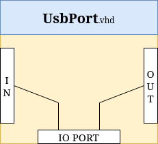
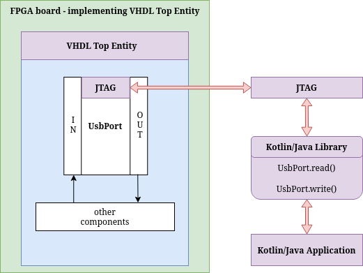
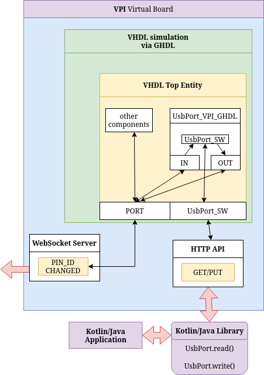

# What is UsbPort?

UsbPort is a "communication" method that allows manipulating VHDL circuit signals via a Kotlin/Java application.
The default UsbPort implementation communicates with the VHDL circuit via [JTAG](https://www.fpga4fun.com/JTAG.html).
UsbPort can only read or write 7 bits to the port (via `UsbPort.read()` or `UsbPort.write(val)`).



:x: The problem with this implementation is that [JTAG](https://www.fpga4fun.com/JTAG.html) depends on a real FPGA board, and since this project aims to "emulate" that, we need to find another way to allow signal manipulation via the Kotlin/Java application.

# Plan

The "emulator" is basically a VPI module running a websocket server and a VHDL simulator (GHDL) in separate threads.
In this case, our [new UsbPort implementation](https://github.com/roby2014/virtual-board-vhdl/blob/main/UsbPort/library/src/main/kotlin/isel/leic/UsbPort.kt) will send **custom** HTTP requests.


# What is the script for?

The script converts a VHDL circuit that uses the default UsbPort implementation into one that can use the GHDL+VPI virtual board, so we can manipulate the signals via server (check [#how-its-done](#how-its-done) for more info).

# UsbPort via JTAG




# UsbPort via GHDL+VPI



# How it's done

Assuming we have a VHDL circuit which uses default UsbPort implementation (via [JTAG](https://www.fpga4fun.com/JTAG.html)), we need to change some things in order to emulate it 100%, such as: 
- Overwrite the component, because with the GHDL simulation, the UsbPort will communicate with the server instead
- Add UsbPort ports to top entity so we can use GHDL to manipulate signals via UsbPort

We will do this via a python script ([usb_port_vpi_ghdl.py](https://github.com/roby2014/virtual-board-vhdl/blob/main/UsbPort/script/usb_port_vpi_ghdl.py)).

So, `UsbPort.vhd` is moved to a temporary folder, and `UsbPort_VPI_GHDL.vhd` is now used:

**UsbPort_VPI_GHDL.vhd**
```vhdl
-- Auto generated by $generate_usb_ports_ghdl.py$ script.
LIBRARY ieee;
USE ieee.STD_LOGIC_1164.ALL;

ENTITY UsbPort_VPI_GHDL IS
    PORT (
        inputPort : IN STD_LOGIC_VECTOR(7 DOWNTO 0);
        outputPort : OUT STD_LOGIC_VECTOR(7 DOWNTO 0);
        inputPort_SW : OUT STD_LOGIC_VECTOR(7 DOWNTO 0);
        outputPort_SW : IN STD_LOGIC_VECTOR(7 DOWNTO 0)
    );
END ENTITY;

ARCHITECTURE UsbPort OF UsbPort_VPI_GHDL IS
BEGIN
    inputPort_SW <= inputPort;
    outputPort <= outputPort_SW;
END ARCHITECTURE;
```

The top entity is still using the normal UsbPort implementation, so now we have to replace the component and also add the signals linking. So we move the current top entity file to a temporary folder as well and create another file.

So we transform this:

**source.vhd**
```vhdl
LIBRARY ieee;
USE ieee.STD_LOGIC_1164.ALL;

ENTITY up_counter IS
    PORT (
        clk : IN STD_LOGIC;
        q : OUT STD_LOGIC
    );
END ENTITY;

ARCHITECTURE rtl OF up_counter IS
    COMPONENT UsbPort
        PORT (
            inputPort : IN STD_LOGIC_VECTOR(7 DOWNTO 0);
            outputPort : OUT STD_LOGIC_VECTOR(7 DOWNTO 0)
        );
    END COMPONENT;

BEGIN
    u_usbport : UsbPort
    PORT MAP(
        inputPort(0) => clk,
        inputPort(1) => clk,
        inputPort(2) => clk,
        inputPort(3) => clk,
        inputPort(4) => clk,
        inputPort(5) => clk,
        inputPort(6) => clk,
        inputPort(7) => clk,
        outputPort(0) => q,
        outputPort(1) => q,
        outputPort(2) => q,
        outputPort(3) => q,
        outputPort(4) => q,
        outputPort(5) => q,
        outputPort(6) => q,
        outputPort(7) => q
    );

END ARCHITECTURE;
```

into this:

**source_generated.vhd**
```vhdl
LIBRARY ieee;
USE ieee.STD_LOGIC_1164.ALL;

ENTITY up_counter IS
    PORT (
-- Automated Inserted code for VPI_GHDL
        inputPort_SW : OUT STD_LOGIC_VECTOR(7 DOWNTO 0);
        outputPort_SW : IN STD_LOGIC_VECTOR(7 DOWNTO 0);
-- Automated Inserted code for VPI_GHDL

        clk : IN STD_LOGIC;
        q : OUT STD_LOGIC
    );
END ENTITY;

ARCHITECTURE rtl OF up_counter IS
    COMPONENT UsbPort_VPI_GHDL
        PORT (
-- Automated Inserted code for VPI_GHDL
            inputPort_SW : OUT STD_LOGIC_VECTOR(7 DOWNTO 0);
            outputPort_SW : IN STD_LOGIC_VECTOR(7 DOWNTO 0);
-- Automated Inserted code for VPI_GHDL

            inputPort : IN STD_LOGIC_VECTOR(7 DOWNTO 0);
            outputPort : OUT STD_LOGIC_VECTOR(7 DOWNTO 0)
        );
    END COMPONENT;

BEGIN
    u_usbport : UsbPort_VPI_GHDL 
    PORT MAP(
-- Automated Inserted code for VPI_GHDL
        inputPort_SW => inputPort_SW,
        outputPort_SW => outputPort_SW,
-- Automated Inserted code for VPI_GHDL

        inputPort(0) => clk,
        inputPort(1) => clk,
        inputPort(2) => clk,
        inputPort(3) => clk,
        inputPort(4) => clk,
        inputPort(5) => clk,
        inputPort(6) => clk,
        inputPort(7) => clk,
        outputPort(0) => q,
        outputPort(1) => q,
        outputPort(2) => q,
        outputPort(3) => q,
        outputPort(4) => q,
        outputPort(5) => q,
        outputPort(6) => q,
        outputPort(7) => q
    );

END ARCHITECTURE;
```
