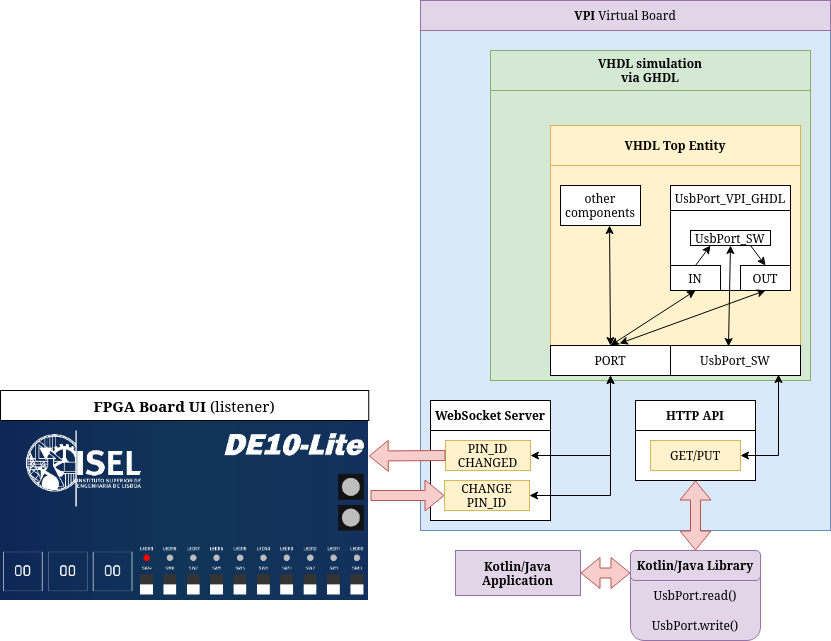

### ⚠️ PROJECT UNDER DEVELOPMENT ⚠️
*do not expect good documentation, clean and working code (for now)*

## Virtual Board for VHDL code simulation

Started in 2022, this project aims to allow VHDL simulation on a "virtual board" (so a FPGA board won't be required), in a more friendly way (so you won't need to look at waveforms again!).

*(It's not an emulator since it does not emulate 100% real hardware)*

## Quick overview

## VHDL Simulation

The VHDL simulation is done via [GHDL](https://github.com/ghdl/ghdl), which runs a [`.vpi`](https://en.wikipedia.org/wiki/Verilog_Procedural_Interface) module built by `g++`. The module interacts with the VHDL simulation via `libghdl` shared library.

We can manipulate the simulation signals values via a websocket server, customize board IO pins and also assign signals to those pins, [read more about the VPI module here](https://github.com/roby2014/virtual-board-vhdl/tree/main/vhdl_vpi).

## UsbPort

One of the goals is also to add compatibility with [UsbPort](https://github.com/roby2014/virtual-board-vhdl/tree/main/UsbPort), which is a library that allows manipulating VHDL circuit signals via a Kotlin/Java application.
This is done via a HTTP server running alongside the VPI.

## Board UI (static)

Since it has a websocket server, it won't be hard to display signals in a "pretty" way to the user.

[Here (fpga_static_ui_example)](https://github.com/roby2014/virtual-board-vhdl/tree/main/fpga_static_ui_example) is a quick UI prototype built with HTML+CSS+JS to show what a board interface can look like.

## Board UI (dynamic)
The good approach would be to create a UI that reads `board.json` and creates a UI with IO signals depending on what pins the config file has. The board should be also customizable via a config file.
Under Development: https://github.com/roby2014/virtual-board-gui

## Credits
- [GHDL](https://github.com/ghdl/ghdl) - VHDL 2008/93/87 simulator
- [ghdl-cosim](https://ghdl.github.io/ghdl-cosim/vpi/examples/index.html) - GHDL co-simulation projects using VPI
- [seasocks](https://github.com/mattgodbolt/seasocks) - Simple, small, C++ embeddable webserver with WebSockets support
- [nlohmann/json](https://github.com/nlohmann/json) - JSON for Modern C++
- [cpp-httplib](https://github.com/yhirose/cpp-httplib) - A C++ header-only HTTP/HTTPS server and client library 
- [khttp](https://github.com/ascclemens/khttp) - Kotlin HTTP requests library
